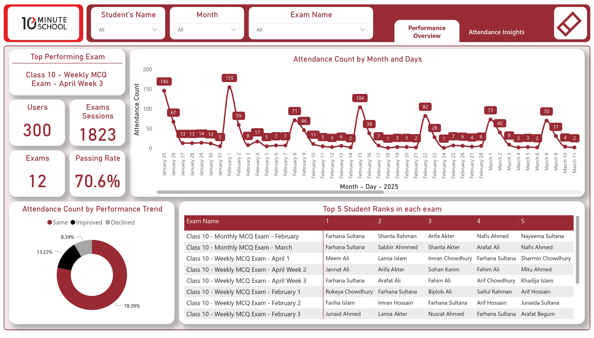
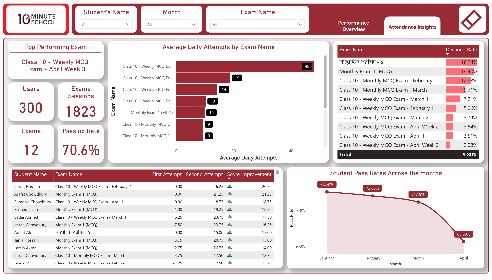

# Assessment-Task-10minuteSchool-Exam-Data
### Day-wise Attendance Trend
The live report is available [here](https://app.powerbi.com/view?r=eyJrIjoiMzcwYWZjNTQtMjIxMS00YjJiLThlZTctNjFkYjA5NTBmZTJiIiwidCI6ImE3ODgzOTdiLWIzYjItNDU2OC1iNTdjLTI5ODY0ZTgxZjdmZiIsImMiOjEwfQ%3D%3D&pageName=8ca6299acbbc977a3066) 

### Daily Attempts by Exam

## 1. Data Modeling & Preparation Summary

### 1.1 Data Preparation

- Dataset imported using Import Mode for better performance.

- Data types corrected (e.g., dates, numerics), and irrelevant/null values removed.

- Created a custom Date table (Dim_Date) to enable time-based filtering.

- Since student names were missing, random names were assigned to 300 users using Dim_User.

### 1.2 Model Structure & Enhancements

- Designed a Star Schema linking Fact_exam_sessions to Dim_exams, Dim_user, and Dim_Date.

- Added key calculated columns:

- Exam Time (Days): Exam duration.

- Score: Based on correct/wrong answers and negative marking from Dim_exams.

- Passed: Based on pass mark criteria.

- Performance Trend: Categorized as Improved, Declined, or Same.

- Created a Top5StudentsPerExam custom Calculated table to support top-performers on each exam Matrix visual.

## 2. Visualizations & Insights

2.1 Dashboard Features

- 2 Paginated Reports with navigation buttons.

- 7 Visuals and 5 KPI Cards.

- 3 Filters (excluding year as data is for 2025 only).

### 2.2 Requirement Fulfillment

- Day-wise Attendance Trend: Line chart on Performance Overview.

- Daily Attempts by Exam: Stacked bar on Attendance Insights.

- Top 5 Students: Matrix on Performance Overview.

- Performance Trend Categories: Donut chart showing trend distribution.

## 3. Optional Analytical Findings

- Top Improver:

- Imran Hossain improved from 0.00 to 26.25 in Class 10 - Weekly MCQ Exam - February 2.

- Decline-Prone Exams: সাপ্তাহিক পরিক্ষা-১, Monthly Exam 1 (MCQ), Class 10 - Monthly MCQ Exam - February

- Exam Date vs. Pass Rate: Exams held on weekends, especially Friday and Wednesday, show lower pass rates, indicating timing impacts student performance.
